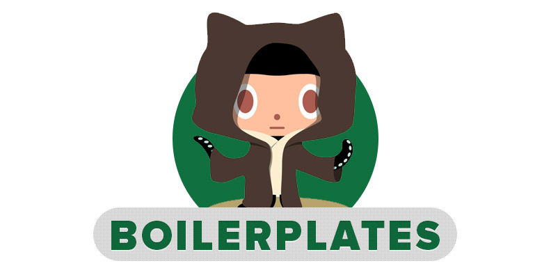

## Welcome [](https://travis-ci.org/vitorbritto/boilerplates)

This is my personal Yeoman. A simple jumpstart for my projects

> **WORK IN PROGRESS!**
> **TODO LIST:** [https://github.com/vitorbritto/boilerplates/issues/1](https://github.com/vitorbritto/boilerplates/issues/1)


## Getting Started

1 - First of all, make sure you have [Node.js](http://nodejs.org/) installed. <br/>
2 - Clone this repository <br/>
3 - Access the generated folder

```bash
$ git clone git://github.com/vitorbritto/boilerplates.git [project-name]
$ cd [project-name]
```

4 - Install dependencies and make the script executable

```bash
$ npm install
$ chmod u+x newproject.js
```

> **Note**: chmod is an UNIX command, not present in MS-DOS.

5 - Execute with: `./newproject.js` <br/>
6 - Profit!


## Boilerplates

Here are the boilerplates available yet.

- [General](lib/templates/general/)
- [Mobile](lib/templates/mobile/)
- [WordPress](lib/templates/wordpress/)
- [Backbone](lib/templates/backbone/)
- [B.E.N.M Stack](lib/templates/benmstack/)
- [Node](lib/templates/node/)
- [Rails](lib/templates/rails/)
- [Jekyll](lib/templates/jekyll/)
- [Harp](lib/templates/harp/)
- [DocPad](lib/templates/docpad/)
- [Ghost](lib/templates/ghost/)

## License

[MIT License](http://vitorbritto.mit-license.org/) © Vitor Britto
