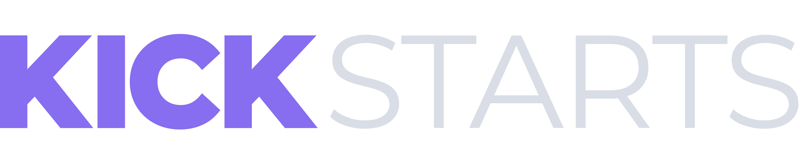

<div id="#top"></div>
<br />

<div align="center">

</div>

<div align="center">
  

  <p align="center">
    No setup! Just development.
    <br />
    <a href="https://github.com/kickstarts/kickstarts/docs">Documentation</a>
    ·
    <a href="https://github.com/kickstarts/kickstarts/issues">Report Bug</a>
    ·
    <a href="https://github.com/kickstarts/kickstarts/blob/main/CONTRIBUTING.md">How to colaborate</a>
  </p>

  [](https://gitter.im/kickstarts/community?utm_source=badge&utm_medium=badge&utm_campaign=pr-badge)
</div>

<!-- TABLE OF CONTENTS -->
<br />
<br />

<details>
  <summary>Summary</summary>
  <ol>
    <li>
      <a href="#about-kickstarts">About Kickstarts</a>
      <ul>
        <li><a href="#built-with">Built With</a></li>
        <li><a href="#plugins">Plugins</li>
      </ul>
    </li>
    <li>
      <a href="#getting-started">Getting Started</a>
    </li>
    <li><a href="#running">Running</a></li>
    <li><a href="#test">Test</a></li>
    <li><a href="#roadmap">Roadmap</a></li>
    <li><a href="#contributing">Contributing</a></li>
    <li><a href="#license">License</a></li>
  </ol>
</details>
<br />
<br />


## About Kickstarts

Kickstarts helps you create fast and secure projects using modern build tools. Have you ever feels like you're freeze in time and spent a lot of time setting up your project? So, Kickstarts came to help you in this way and so many other things.

The approach is quite simple: no setup, just development.

You don't have to spent a lot of time setting up things like automation tasks or generating some sort of controllers, models, views or whatever. You just need to clone a Kickstart that fits to the stack you may wanna use and that's it! You're done.

Kickstarts follows a modern architeture and best pratices to delivery high quality web projects.

<p style="font-size: 14px;" align="right">[<a href="#top">back to top</a>]</p>

### Built With

* [Node.js](https://nodejs.org/en/)

<p style="font-size: 14px;" align="right">[<a href="#top">back to top</a>]</p>


<!-- GETTING STARTED -->
## Getting Started

The first step to play with Kickstarts, is to install it. You may need to install `nodejs` in your local machine. Then, execute on terminal:

```sh
$ npm i -g kickstarts
```


## Running

To start using Kickstarts, just type the follow command on your terminal:

```sh
$ kick start
```

<!-- ROADMAP -->
## Roadmap

- [ ] Add Guidelines
- [ ] Add plugins content
- [ ] Review plugins


<!-- CONTRIBUTING -->
## Contributing

See [Contributing Guide](https://github.com/kickstarts/kickstarts/blob/main/CONTRIBUTING.md).

<p style="font-size: 14px;" align="right">[<a href="#top">back to top</a>]</p>


<!-- LICENSE -->
## License

[MIT License](LICENSE) © Kickstarts

<p style="font-size: 14px;" align="right">[<a href="#top">back to top</a>]</p>
